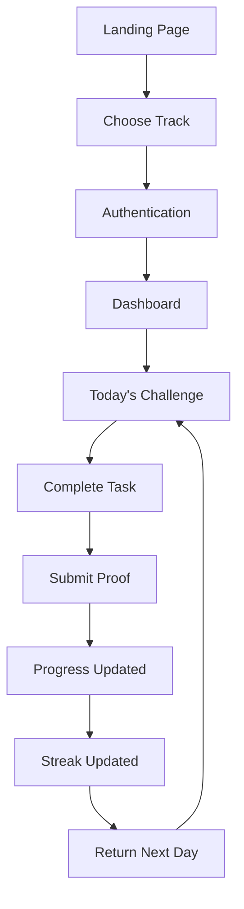
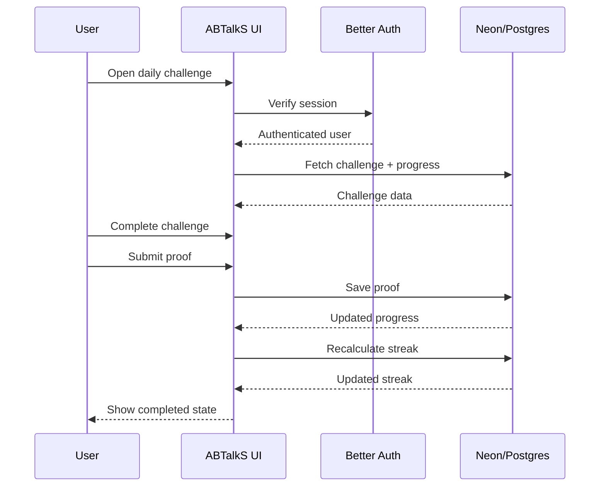
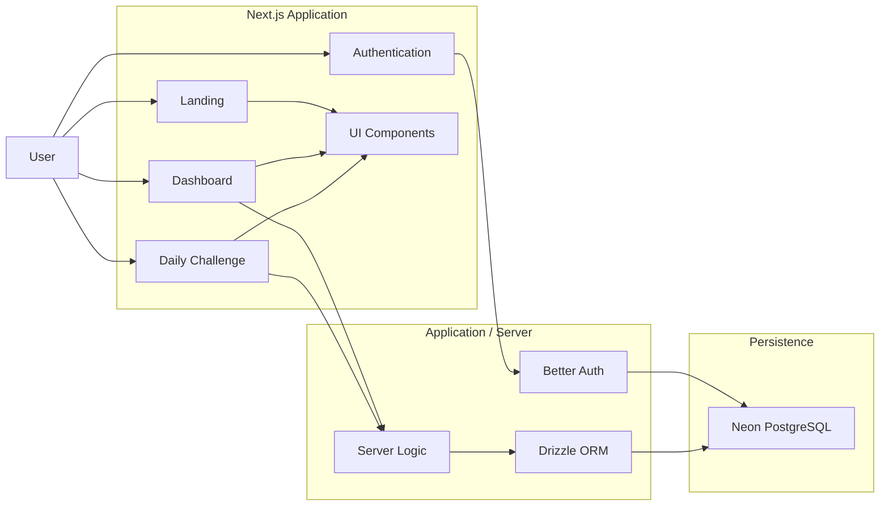

# ABTalkS

### A 60-Day Coding Challenge built around discipline, proof, and consistency.

**ABTalkS** is a redesigned 60-day coding challenge experience focused on turning daily coding into a visible, trackable habit.

Instead of treating a coding challenge as a simple list of tasks, ABTalkS brings together **daily progress, streaks, proof of work, authentication, track selection, and a focused day-by-day experience** inside one product.

> **Code every day. Show your proof. Keep your streak alive.**

[**Live Demo →**](https://abtalks-ten.vercel.app)

---

## The Idea

A 60-day coding challenge is easy to start.

The harder part is staying consistent.

ABTalkS is designed around a simple loop:

```text
Choose your track
      ↓
Start the challenge
      ↓
Complete today's task
      ↓
Submit proof
      ↓
Maintain your streak
      ↓
Come back tomorrow
```

The goal is not just to show another coding challenge dashboard.

The goal is to make **daily progress feel visible and meaningful**.

---

## What I Built

The experience is centered around three primary surfaces:

| Experience   | Purpose                                                         |
| ------------ | --------------------------------------------------------------- |
| `/`          | Introduces the challenge and gets users started                 |
| `/dashboard` | Shows challenge progress, streaks and personal status           |
| `/day/[day]` | Provides the focused experience for an individual challenge day |

The product also includes supporting experiences such as authentication, track selection, proof submission, help, streak management and persistent user data.

---

## Core Features

### 60-Day Challenge

A structured challenge experience designed around completing one day at a time.

### Track Selection

Users can select the challenge track that fits their goals and continue their journey with a personalized challenge experience.

### Daily Challenge Experience

Each challenge day has its own focused page instead of forcing users to navigate through a large dashboard for every task.

### Proof of Work

Users can attach proof links to their progress, including:

* GitHub
* LinkedIn

This makes the challenge about **showing what was actually done**, not simply checking a box.

### Streak Tracking

Progress is connected to a server-computed streak system so consistency becomes part of the challenge experience.

### Streak Freeze

A streak freeze mechanism provides a way to protect progress when a user misses a day.

### Authentication

ABTalkS uses real email/password authentication rather than relying entirely on mock client-side state.

### Persistent Data

Challenge and proof data is persisted using a real database and scoped to authenticated users.

### Help Experience

A dedicated help panel provides contextual guidance without taking users away from the main challenge flow.

### Responsive UI

The interface is designed around a compact, focused experience, with particular attention to mobile-sized layouts.

---

## Product Flow



The product is intentionally designed around a **repeatable daily loop** rather than a one-time onboarding experience.

---

## Daily Challenge Flow



---

# Architecture



---

# Tech Stack

| Layer          | Technology       |
| -------------- | ---------------- |
| Framework      | Next.js 16       |
| Language       | TypeScript       |
| UI             | React 19         |
| Styling        | Tailwind CSS 4   |
| Components     | shadcn / Base UI |
| Authentication | Better Auth      |
| Database       | Neon PostgreSQL  |
| ORM            | Drizzle ORM      |
| Animations     | Framer Motion    |
| Icons          | Lucide React     |
| Data Fetching  | SWR              |
| Notifications  | Sonner           |
| Analytics      | Vercel Analytics |
| Deployment     | Vercel           |

The dependency setup in the repository includes Next.js 16, React 19, Better Auth, Drizzle ORM, Neon/Postgres support, Framer Motion, Tailwind CSS 4 and the other UI/runtime packages used by the application.

---

# Data & Authentication

ABTalkS was intentionally built around **real persistence rather than a mock-only prototype**.

The application uses:

```text
User
 │
 ├── Authentication
 │
 ├── Challenge Track
 │
 ├── Daily Progress
 │
 ├── Proof Links
 │
 └── Streak State
```

Authentication is handled through **Better Auth**, while persistent challenge data is stored in **Neon/Postgres** through **Drizzle ORM**.

User-specific challenge and proof data is scoped to the authenticated user on the server.

---

# UI Direction

ABTalkS intentionally moves away from the visual language of a conventional learning-management dashboard.

The interface uses:

* Bold typography
* Analog / marker-inspired visual elements
* Strong visual hierarchy
* Focused daily interactions
* Progress and streak emphasis
* Responsive layouts
* Motion for feedback and transitions

The visual direction was part of the redesign rather than being treated as decoration added after the functionality.

---

# Design Philosophy

### 01 — Make progress visible

A user should immediately understand:

> Where am I?

> What did I complete?

> What do I need to do today?

### 02 — One day at a time

Sixty days can feel overwhelming.

One day is manageable.

The experience therefore puts the **current challenge** at the center of the product.

### 03 — Proof over promises

Completing a checkbox is easy.

Showing evidence of the work creates accountability.

ABTalkS therefore supports GitHub and LinkedIn proof links as part of the challenge flow.

### 04 — Consistency matters

The streak system turns repeated daily action into a visible part of the experience.

---

# Project Structure

```text
codexmatrix-redesign-abtalks/
│
├── app/
│   ├── ...
│   └── routes and server-side application logic
│
├── components/
│   ├── ...
│   └── reusable UI components
│
├── hooks/
│   └── client-side hooks
│
├── lib/
│   └── application utilities, auth and data logic
│
├── public/
│   └── static assets
│
├── AGENTS.md
├── CLAUDE.md
├── prompts.md
├── components.json
├── next.config.mjs
├── package.json
├── postcss.config.mjs
└── tsconfig.json
```

The repository also includes a dedicated `prompts.md` file documenting the prompts and product decisions used during the rebuild.

---

# AI-Assisted Development

ABTalkS was developed using an **AI-assisted engineering workflow**.

The project maintains a prompt history documenting the progression from the initial product concept through:

1. Initial 60-day challenge build
2. Authentication and persistence
3. Three-route product scope
4. Neon database integration
5. Better Auth integration
6. ABTalkS visual redesign
7. Track selection
8. GitHub and LinkedIn proof
9. Server-computed streaks
10. Streak freeze support
11. End-to-end feature completion
12. Repository and deployment preparation

This history is intentionally kept inside the repository through `prompts.md` so the development process remains inspectable rather than hidden.

---

# Development Philosophy

The project was approached as a **product redesign**, not just a page recreation.

That meant thinking about:

* User flow
* Information hierarchy
* Authentication
* Persistence
* Daily interaction loops
* Proof of work
* Streak logic
* Responsive behavior
* Visual identity
* Error states
* Real-world data

The result is intended to demonstrate both **interface design and application engineering**.

---

# Getting Started

## Prerequisites

Make sure you have:

* Node.js
* npm or pnpm
* A PostgreSQL-compatible database
* The required authentication/database environment variables

## Clone the repository

```bash
git clone https://github.com/the-nidhi-bhat/codexmatrix-redesign-abtalks.git
cd codexmatrix-redesign-abtalks
```

## Install dependencies

Using npm:

```bash
npm install
```

Or using pnpm:

```bash
pnpm install
```

## Configure environment variables

Create:

```text
.env.local
```

and provide the environment values required by the authentication and database configuration.

**Do not commit secrets, tokens, database credentials or private environment values.**

## Start the development server

```bash
npm run dev
```

Then open:

```text
http://localhost:3000
```

---

# Available Scripts

```bash
npm run dev
```

Starts the local development server.

```bash
npm run build
```

Creates a production build.

```bash
npm run start
```

Starts the production server.

```bash
npm run lint
```

Runs ESLint across the project.

These scripts are defined in the project's `package.json`.

---

# Deployment

The project is deployed through Vercel.

### Live Application

**ABTalkS**

https://abtalks-ten.vercel.app

The GitHub repository currently points to the deployed ABTalkS application as its project homepage.

---

# Hackathon Focus

This project was created as a redesign-oriented hackathon submission with a focus on combining:

**Product thinking + UI/UX + full-stack implementation + AI-assisted development**

The key challenge was not simply to reproduce an existing interface.

It was to turn the concept of a **60-day coding challenge** into a more cohesive product experience where:

```text
Challenge
   ↓
Daily Action
   ↓
Proof
   ↓
Progress
   ↓
Streak
   ↓
Consistency
```

becomes the central interaction loop.

---

# What This Project Demonstrates

### Product Design

Designing a complete user journey instead of isolated screens.

### Frontend Engineering

Building a responsive Next.js application with reusable components and modern React patterns.

### Backend Integration

Connecting authentication, server logic and persistent database state.

### Data Modeling

Representing challenge progress, proof and streak information as persistent user data.

### UX Thinking

Reducing a large 60-day goal into a focused daily experience.

### AI-Assisted Development

Using structured prompts and AI-assisted iteration while maintaining a documented development history.

---

# Project Status

| Area                       | Status      |
| -------------------------- | ----------- |
| Landing experience         | Complete    |
| Dashboard                  | Complete    |
| Daily challenge experience | Complete    |
| Authentication             | Implemented |
| Track selection            | Implemented |
| Proof links                | Implemented |
| Streak tracking            | Implemented |
| Streak freeze              | Implemented |
| Database persistence       | Implemented |
| Responsive UI              | Implemented |
| Vercel deployment          | Live        |
| Prompt history             | Documented  |

---

# Repository

**GitHub:**
https://github.com/the-nidhi-bhat/codexmatrix-redesign-abtalks

**Live Demo:**
https://abtalks-ten.vercel.app

---

# Built By

**Nidhi**

Computer Science & Business Systems student focused on software development, AI-assisted building and product-oriented engineering.

---

## Final Thought

ABTalkS is built around a simple idea:

> **Consistency is easier when progress is visible.**

Instead of asking users to think about all 60 days at once, the product brings the focus back to one challenge, one proof, and one day at a time.

**60 days.
One day at a time.
Show the work.**
